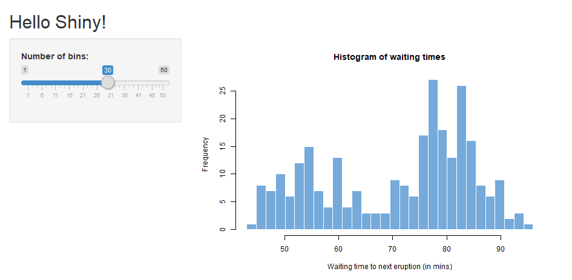
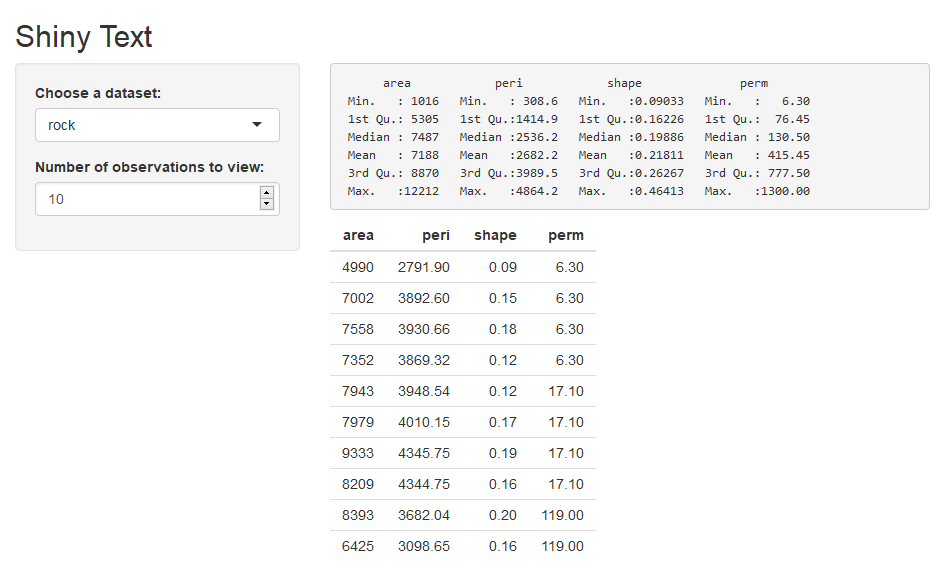
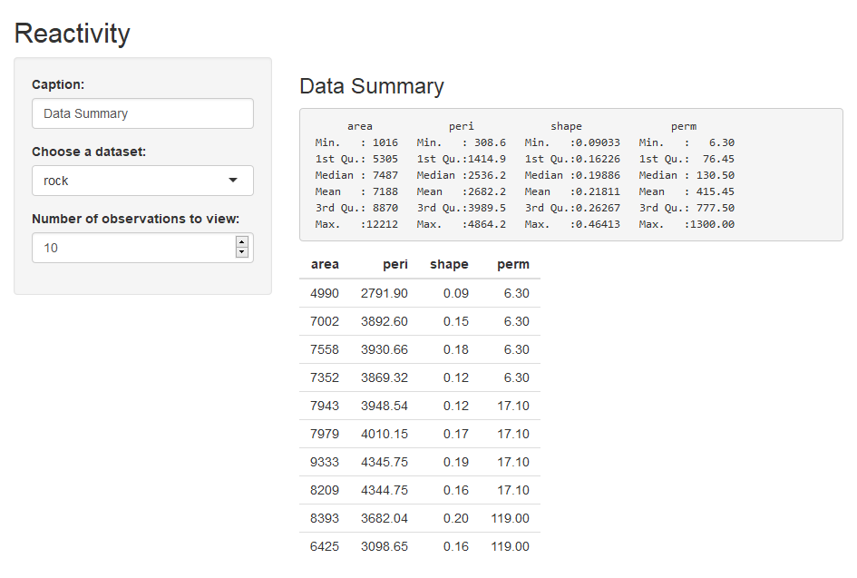
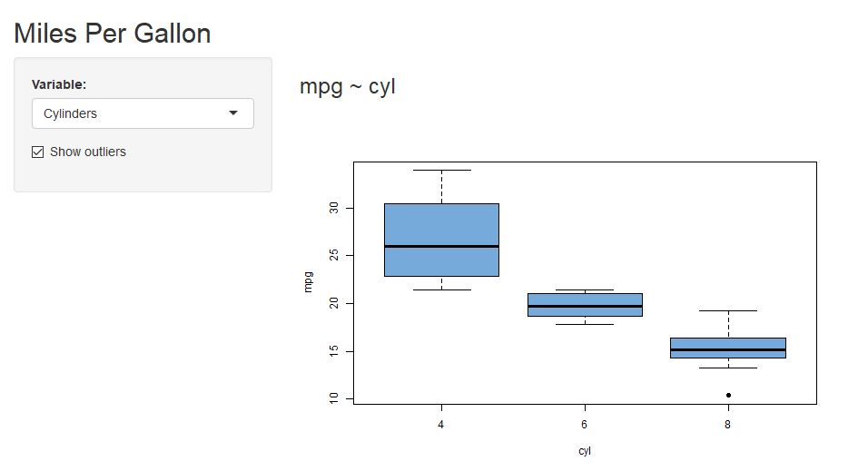
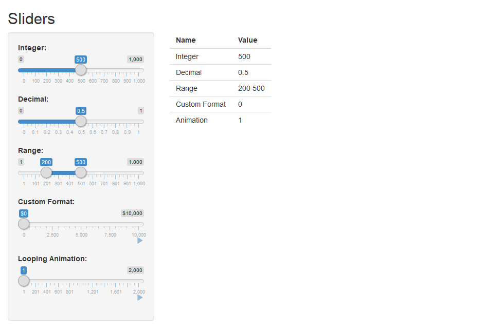
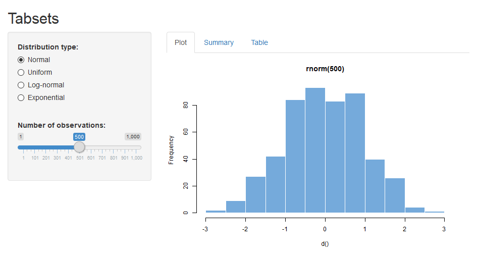
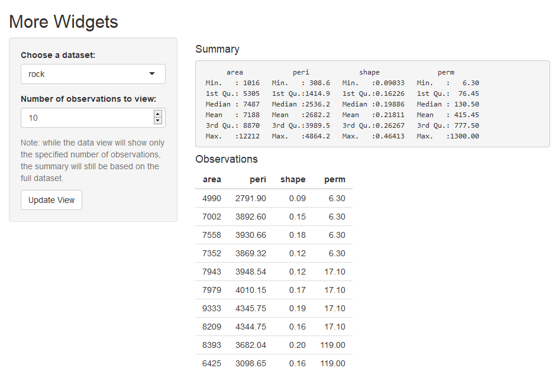

Shiny is an R package that makes it easy to build interactive 
web apps straight from R. You can host standalone apps on a 
webpage or embed them in R Markdown documents or build dashboards. 
You can also extend your Shiny apps with CSS themes, 
htmlwidgets, and JavaScript actions. 


## Installation

To install the stable version from CRAN, simply run the following from an R console:


```r
install.packages("shiny")
```

To install the latest development builds directly from GitHub, run this instead:


```r
if (!require("remotes")) install.packages("remotes")
remotes::install_github("rstudio/shiny")
```

## Load Shiny


```r
library(shiny)
```

## Built-in examples {.tabset .tabset-pills}

A Shiny app is built with two pieces:

+ a `ui` (*i.e.*, *user interface*), how and where output have to be displayed.
+ a `server`, where computations happen.


```r
shinyApp(ui = ui, server = server)
```


Let's test `shiny` and look at some examples (eleven built-in examples available).
 


```r
cat(paste("+", list.files(system.file("examples", package = "shiny"))), sep = "\n")
```

+ 01_hello
+ 02_text
+ 03_reactivity
+ 04_mpg
+ 05_sliders
+ 06_tabsets
+ 07_widgets
+ 08_html
+ 09_upload
+ 10_download
+ 11_timer


### "hello" {- .tabset}


```r
runExample("01_hello")
```




#### ui {-}


```
ui <- fluidPage(
  titlePanel("Hello Shiny!"),
  sidebarLayout(
    sidebarPanel(
      sliderInput(inputId = "bins",
                  label = "Number of bins:",
                  min = 1,
                  max = 50,
                  value = 30)
    ),
    mainPanel(
      plotOutput(outputId = "distPlot")
    )
  )
)
```

#### server {-}


```
server <- function(input, output) {
  output$distPlot <- renderPlot({
    x    <- faithful$waiting
    bins <- seq(min(x), max(x), length.out = input$bins + 1)
         xlab = "Waiting time to next eruption (in mins)",
         main = "Histogram of waiting times")
    })
}
```


### "text" {- .tabset}


```r
runExample("02_text")
```




#### ui {-}


```
ui <- fluidPage(
  titlePanel("Shiny Text"),
  sidebarLayout(
    sidebarPanel(
      selectInput(inputId = "dataset",
                  label = "Choose a dataset:",
                  choices = c("rock", "pressure", "cars")),
      numericInput(inputId = "obs",
                   label = "Number of observations to view:",
                   value = 10)
    ),
    mainPanel(
      verbatimTextOutput("summary"),
      tableOutput("view")
    )
  )
)
```

#### server {-}


```
server <- function(input, output) {
  datasetInput <- reactive({
    switch(input$dataset,
           "rock" = rock,
           "pressure" = pressure,
           "cars" = cars)
  })
  output$summary <- renderPrint({
    dataset <- datasetInput()
    summary(dataset)
  })
  output$view <- renderTable({
    head(datasetInput(), n = input$obs)
  })
}
```


### "reactivity" {- .tabset}


```r
runExample("03_reactivity")
```




#### ui {-}


```
ui <- fluidPage(
  titlePanel("Reactivity"),
  sidebarLayout(
    sidebarPanel(
      textInput(inputId = "caption",
                label = "Caption:",
                value = "Data Summary"),
      selectInput(inputId = "dataset",
                  label = "Choose a dataset:",
                  choices = c("rock", "pressure", "cars")),
      numericInput(inputId = "obs",
                   label = "Number of observations to view:",
                   value = 10)
    ),
    mainPanel(
      h3(textOutput("caption", container = span)),
      verbatimTextOutput("summary"),
      tableOutput("view")
    )
  )
)
```

#### server {-}


```
server <- function(input, output) {
  #
  datasetInput <- reactive({
    switch(input$dataset,
           "rock" = rock,
           "pressure" = pressure,
           "cars" = cars)
  })
  #
  #
  output$caption <- renderText({
    input$caption
  })
  output$summary <- renderPrint({
    dataset <- datasetInput()
    summary(dataset)
  })
  output$view <- renderTable({
    head(datasetInput(), n = input$obs)
  })
}
```


### "mpg" {- .tabset}


```r
runExample("04_mpg")
```




#### ui {-}


```
ui <- fluidPage(
  titlePanel("Miles Per Gallon"),
  sidebarLayout(
    sidebarPanel(
      selectInput("variable", "Variable:",
                  c("Cylinders" = "cyl",
                    "Transmission" = "am",
                    "Gears" = "gear")),
      checkboxInput("outliers", "Show outliers", TRUE)
    ),
    mainPanel(
      h3(textOutput("caption")),
      plotOutput("mpgPlot")
    )
  )
)
```

#### server {-}


```
server <- function(input, output) {
  formulaText <- reactive({
    paste("mpg ~", input$variable)
  })
  output$caption <- renderText({
    formulaText()
  })
  output$mpgPlot <- renderPlot({
    boxplot(as.formula(formulaText()),
            data = mpgData,
            outline = input$outliers,
            col = "#75AADB", pch = 19)
  })
}
```


### "sliders" {- .tabset}


```r
runExample("05_sliders")
```




#### ui {-}


```
ui <- fluidPage(
  titlePanel("Sliders"),
  sidebarLayout(
    sidebarPanel(
      sliderInput("integer", "Integer:",
                  min = 0, max = 1000,
                  value = 500),
      sliderInput("decimal", "Decimal:",
                  min = 0, max = 1,
                  value = 0.5, step = 0.1),
      sliderInput("range", "Range:",
                  min = 1, max = 1000,
                  value = c(200,500)),
      sliderInput("format", "Custom Format:",
                  min = 0, max = 10000,
                  value = 0, step = 2500,
                  pre = "$", sep = ",",
                  animate = TRUE),
      sliderInput("animation", "Looping Animation:",
                  min = 1, max = 2000,
                  value = 1, step = 10,
                  animate =
                    animationOptions(interval = 300, loop = TRUE))
    ),
    mainPanel(
      tableOutput("values")
    )
  )
)
```

#### server {-}


```
server <- function(input, output) {
  sliderValues <- reactive({
    data.frame(
      Name = c("Integer",
               "Decimal",
               "Range",
               "Custom Format",
               "Animation"),
      Value = as.character(c(input$integer,
                             input$decimal,
                             paste(input$range, collapse = " "),
                             input$format,
                             input$animation)),
      stringsAsFactors = FALSE)
  })
  output$values <- renderTable({
    sliderValues()
  })
}
```


### "tabsets" {- .tabset}


```r
runExample("06_tabsets")
```




#### ui {-}


```
ui <- fluidPage(
  titlePanel("Tabsets"),
  sidebarLayout(
    sidebarPanel(
      radioButtons("dist", "Distribution type:",
                   c("Normal" = "norm",
                     "Uniform" = "unif",
                     "Log-normal" = "lnorm",
                     "Exponential" = "exp")),
      br(),
      sliderInput("n",
                  "Number of observations:",
                  value = 500,
                  min = 1,
                  max = 1000)
    ),
    mainPanel(
      tabsetPanel(type = "tabs",
                  tabPanel("Plot", plotOutput("plot")),
                  tabPanel("Summary", verbatimTextOutput("summary")),
                  tabPanel("Table", tableOutput("table"))
      )
    )
  )
)
```

#### server {-}


```
server <- function(input, output) {
  d <- reactive({
    dist <- switch(input$dist,
                   norm = rnorm,
                   unif = runif,
                   lnorm = rlnorm,
                   exp = rexp,
                   rnorm)
    dist(input$n)
  })
  output$plot <- renderPlot({
    dist <- input$dist
    n <- input$n
    hist(d(),
         main = paste("r", dist, "(", n, ")", sep = ""),
         col = "#75AADB", border = "white")
  })
  output$summary <- renderPrint({
    summary(d())
  })
  output$table <- renderTable({
    d()
  })
}
```


### "widgets" {- .tabset}


```r
runExample("07_widgets")
```




#### ui {-}


```
ui <- fluidPage(
  titlePanel("More Widgets"),
  sidebarLayout(
    sidebarPanel(
      selectInput("dataset", "Choose a dataset:",
                  choices = c("rock", "pressure", "cars")),
      numericInput("obs", "Number of observations to view:", 10),
      helpText("Note: while the data view will show only the specified",
               "number of observations, the summary will still be based",
               "on the full dataset."),
      actionButton("update", "Update View")
    ),
    mainPanel(
      h4("Summary"),
      verbatimTextOutput("summary"),
      h4("Observations"),
      tableOutput("view")
    )
  )
)
```

#### server {-}


```
server <- function(input, output) {
  datasetInput <- eventReactive(input$update, {
    switch(input$dataset,
           "rock" = rock,
           "pressure" = pressure,
           "cars" = cars)
  }, ignoreNULL = FALSE)
  output$summary <- renderPrint({
    dataset <- datasetInput()
    summary(dataset)
  })
  output$view <- renderTable({
    head(datasetInput(), n = isolate(input$obs))
  })
}
```

