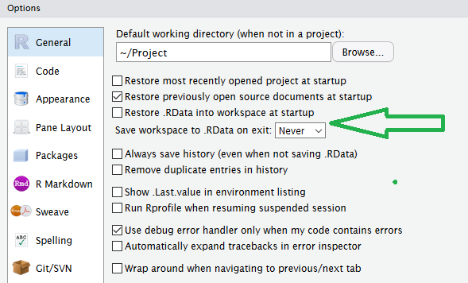
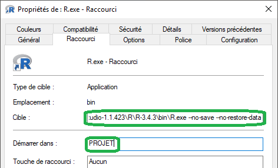

<style>.title-slide hgroup h1 { font-size: 600%; }</style>
<link rel="stylesheet" href="https://cdnjs.cloudflare.com/ajax/libs/font-awesome/5.11.2/css/all.min.css">

```{r setup, include = FALSE}
options(stringsAsFactors = FALSE)
options(width = 80)
options(kableExtra.html.bsTable = TRUE)
# options(tibble.print_max = 3, tibble.print_min = 3)
# Sys.setlocale("LC_TIME", "english_united kingdom.1252")

output_directory <- params[["output_directory"]]

### Load packages and functions
library(tidyverse)
library(scales)
library(grid)
library(knitr)
library(rmarkdown)
library(kableExtra)
library(fs)
library(shiny)

devtools::source_url("https://github.com/mcanouil/DEV/raw/master/R/theme_black.R")

dpi <- 120

### Set knitr rmarkdown chunk options
opts_chunk$set(
  include = TRUE,
  echo = TRUE,
  warning = TRUE,
  message = TRUE,
  eval = params[["eval"]],
  tidy = FALSE,
  crop = TRUE,
  autodep = TRUE,
  dpi = dpi,
  # cache = FALSE,
  # cache.path = NULL,
  width = getOption("width"),
  results = "asis",
  comment = "#>",
  fig.align = "center",
  fig.path = "images/"
)

### Define theme
theme_set(theme_black(base_size = 11))
```

# Préparer sa session | <i class="fab fa-r-project" style="font-size: 250px;"></i> {.flexbox .vcenter}

<!-- </img> -->


## Trucs et astuces

*  Eviter de changer votre répertoire de travail avec `setwd()`.
*  Ne pas utiliser de `.Rprofile` modifiant <i class="fab fa-r-project"></i>.
*  Désactiver la conversion automatique en facteurs `options(stringsAsFactors = FALSE)`.
*  Ne pas utiliser `rm(list = ls())` pour "rafraichir".
*  Ne pas utiliser la sauvegarde/restauration par défaut de <i class="fab fa-r-project"></i>.

<div class="columns-2">
```{r, eval = TRUE, echo = FALSE, out.width = 350, out.extra = 'width="350" class="shadow" style="margin: auto;"'}

```
</br>
```{r, eval = TRUE, echo = FALSE, out.width = 350, out.extra = 'width="350" class="shadow" style="margin: auto;"'}

```
</div>

# Qu'est-ce que <i class="glow">Shiny</i> ? {.flexbox .vcenter}

```{r, eval = TRUE, echo = FALSE, out.height = 250, out.width = 216, out.extra = 'class="auto-fadein" style="margin: 20px auto auto auto;"'}
knitr::include_graphics("images/shiny.png")
```


## Avant <i class="glow">Shiny</i> ...

Il était nécessaire de connaître/maîtriser :

* **HTML**, pour concevoir des pages (statique) web.

* **CSS**, pour ajouter du _style_ à une page HTML.

* **JavaScript**, pour effectuer des "calculs" au sein d'une page HTML (via un navigateur).


## <i class="glow">Shiny</i>

Shiny est une extension <i class="fab fa-r-project"></i> permettant la création d'application web interactive directement depuis <i class="fab fa-r-project"></i>. 

* Page internet.
* Documents (R Markdown) interactifs.
* Tableaux de bords.

Les applications Shiny sont compatibles avec :

* CSS.
* "html widgets".
* JavaScript.

## Installation & Chargement

La version stable de Shiny peut se télécharger sur le CRAN.
```{r}
install.packages("shiny")
```

La version en développement est disponible sur GitHub <i class="fab fa-github"></i>.
```{r}
if (!require("remotes")) install.packages("remotes")
remotes::install_github("rstudio/shiny")
```

Charger Shiny dans sa session <i class="fab fa-r-project"></i>.
```{r}
library("shiny")
```


## Composantes d'une application <i class="glow">Shiny</i>

+ L'extension Shiny.
    ```{r, code = readLines("materials/00-app/app.R", encoding = "UTF-8")[1]}
    ```

+ Une interface (`ui`, *i.e.*, "user interface").
    ```{r, code = readLines("materials/00-app/app.R", encoding = "UTF-8")[3]}
    ```

+ Une fonction serveur (`server`).
    ```{r, code = readLines("materials/00-app/app.R", encoding = "UTF-8")[5]}
    ```

+ La construction d'un objet "Shiny app".
    ```{r, code = readLines("materials/00-app/app.R", encoding = "UTF-8")[7]}
    ```


## Composantes d'une application <i class="glow">Shiny</i>

L'application Shiny peut être démarrée par simple exécution.

```{r, code = readLines("materials/00-app/app.R", encoding = "UTF-8")}
```


## Composantes d'une application <i class="glow">Shiny</i>

Ou via un script `app.R`, placé dans un répertoire portant généralement le nom de l'application.

```{r, echo = FALSE, eval = TRUE, results = "markup", comment = ""}
fs::dir_tree("materials/00-app")
```


```{r, code = readLines("materials/00-app/app.R", encoding = "UTF-8")}
```

```{r}
shiny::runApp("materials/00-app/app.R")
```


## Composantes d'une application <i class="glow">Shiny</i>

Une fois l'application démarrée, vous devriez voir une fenêtre s'ouvrir.
```{r}
shiny::runApp("materials/00-app/app.R")
```
```{r}
#> Listening on http://127.0.0.1:4550
```
```{r, echo = FALSE, eval = TRUE, fig.align = "left", out.extra = 'class="shadow" style="margin: auto;"'}
app_name <- "01"
webshot::appshot(
  app = paste0("materials/", app_name, "-app/app.R"), 
  delay = 1,
  vwidth = 7.56 * dpi,
  # vheight = 4.7 * dpi / 2,
  selector = ".container-fluid",
  envvars = c(display.mode = "normal"),
  file = paste0("images/", app_name, ".png"), 
)
knitr::include_graphics(paste0("images/", app_name, ".png"), dpi = dpi)
```

<div class="notes">
* URL par défaut (hôte)
* Port défini au hasard
* Console R "occupée"
    * Bouton "stop"
    * `Ctrl`+ `c`
    * Fermer la fenêtre de l'application
</div>


## L'interface (`ui`)

Pour ajouter des contrôles (`*Input()`).

```{r, code = readLines("materials/00-app/app.R", encoding = "UTF-8")[3]}
```

```{r, code = readLines("materials/01-app/app.R", encoding = "UTF-8")[c(4, 7, 10)]}
```


## L'interface (`ui`)

Pour ajouter des contrôles (`*Input()`).

```{r, code = readLines("materials/00-app/app.R", encoding = "UTF-8")[3]}
```

```{r, code = readLines("materials/01-app/app.R", encoding = "UTF-8")[c(3:5, 7, 9:11)]}
```

* `fluidPage()`, la fonction gérant la structure de la page internet ("responsive web design").


## L'interface (`ui`)

Pour ajouter des contrôles (`*Input()`).

```{r, code = readLines("materials/00-app/app.R", encoding = "UTF-8")[3]}
```

```{r, code = readLines("materials/01-app/app.R", encoding = "UTF-8")[c(4, 6:8, 10)]}
```

* `textInput()`, la fonction gérant un champ de saisie de texte.

## L'interface (`ui`)

Les contrôles (`*Input()`) nativement disponibles :

```{r, eval = TRUE, echo = FALSE, results = "asis"}
list_input <- grep("^[^uv].+Input$", ls("package:shiny"), value = TRUE)
list_input <- setdiff(list_input, c("snapshotPreprocessInput", "restoreInput"))

cat('<div style="font-size: 75%;">')
cat(paste0("* `", list_input[1:floor(length(list_input) / 2)], "()`"), sep = "\n")
cat(paste0("* `", list_input[(floor(length(list_input) / 2) + 1): length(list_input)], "()`"), sep = "\n")
cat("</div>")
```


## L'interface (`ui`)

```{r}
shiny::runApp("materials/01-app/app.R")
```
```{r}
#> Listening on http://127.0.0.1:4550
```
```{r, echo = FALSE, eval = TRUE, fig.align = "left", out.extra = 'class="shadow" style="margin: auto;"'}
app_name <- "01"
webshot::appshot(
  app = paste0("materials/", app_name, "-app/app.R"), 
  delay = 1,
  vwidth = 7.56 * dpi,
  # vheight = 4.7 * dpi / 2,
  selector = ".container-fluid",
  envvars = c(display.mode = "normal"),
  file = paste0("images/", app_name, ".png"), 
)
knitr::include_graphics(paste0("images/", app_name, ".png"), dpi = dpi)
```


## Le serveur (`server`)

Notre application ne contient aucune action serveur (`server`).

```{r, code = readLines("materials/01-app/app.R", encoding = "UTF-8")[c(1:2, 4, 7, 10, 12:15)]}
```


## Le serveur (`server`)

* Du `server` à `ui` \(\rightarrow\) `output`.

```{r, code = readLines("materials/02-app/app.R", encoding = "UTF-8")[c(17, 19:20, 31:32, 34)]}
```

```{r}
###<b>
output$id <- renderTYPE({
###</b>
  # Une expression générant la sortie de type "TYPE"
###<b>
})
###</b>
```

* Partie _gauche_ : objet (`output`) renvoyé vers l'interface (`ui`) avec un identifiant unique (`id`).

* Partie _droite_ : fonction spécifique pour générer la sortie qui pourra être affichée dans l'interface (`ui`).


## Le serveur (`server`)

Les fonctions `render*()` nativement disponibles :

```{r, eval = TRUE, echo = FALSE, results = "asis"}
cat(paste0("* `", grep("^render*", ls("package:shiny"), value = TRUE), "()`"), sep = "\n")
```


## Le serveur (`server`)

* Du `server` à `ui` \(\rightarrow\) `output`.

```{r, code = readLines("materials/02-app/app.R", encoding = "UTF-8")[c(17, 19:20, 31:32, 34)]}
```

* `textOutput()`, la fonction gérant l'affichage des éléments construits par le serveur (`server`).

```{r, code = readLines("materials/02-app/app.R", encoding = "UTF-8")[c(4, 7, 9:11, 13)]}
```


## Le serveur (`server`)

* De `ui` au `server` \(\rightarrow\) `input`.

```{r, code = readLines("materials/02-app/app.R", encoding = "UTF-8")[c(4, 6:8, 10, 13)]}
```

```{r, code = readLines("materials/02-app/app.R", encoding = "UTF-8")[c(17, 20, 23:28, 31, 34)]}
```

## Première application <i class="glow">Shiny</i>

```{r, code = readLines("materials/02-app/app.R", encoding = "UTF-8")[c(1:2, 4, 7, 10, 13, 15, 17, 20, 23:24, 26, 28, 31, 34, 36:37)]}
```


## Première application <i class="glow">Shiny</i>

```{r}
shiny::runApp("materials/02-app/app.R")
```
```{r}
#> Listening on http://127.0.0.1:4550
```
```{r, echo = FALSE, eval = TRUE, fig.align = "left", out.extra = 'class="shadow" style="margin: auto;"'}
app_name <- "02"
webshot::appshot(
  app = paste0("materials/", app_name, "-app/app.R"), 
  delay = 1,
  vwidth = 7.56 * dpi,
  # vheight = 4.7 * dpi / 2,
  selector = ".container-fluid",
  envvars = c(display.mode = "normal"),
  file = paste0("images/", app_name, ".png"), 
)
knitr::include_graphics(paste0("images/", app_name, ".png"), dpi = dpi)
```


## Mise en pratique

Quelques exercices ...


## Les `input` en détails

```{r, code = readLines("materials/02-app/app.R", encoding = "UTF-8")[7]}
```

Contraintes sur les valeurs de `inputID` :

* Doit être unique.
* Chaîne de caractères alphanumériques et "underscores".


## `input` de type texte

```{r, code = readLines("materials/03-app/app.R", encoding = "UTF-8")[3:7]}
```
```{r, echo = FALSE, eval = TRUE, fig.align = "left", out.extra = 'class="shadow" style="margin: auto;"'}
app_name <- "03"
webshot::appshot(
  app = paste0("materials/", app_name, "-app/app.R"), 
  delay = 1,
  vwidth = 3 * dpi,
  # vheight = 4.7 * dpi / 2,
  selector = ".container-fluid",
  envvars = c(display.mode = "normal"),
  file = paste0("images/", app_name, ".png"), 
)
knitr::include_graphics(paste0("images/", app_name, ".png"), dpi = dpi)
```


## `input` de type numérique

```{r, code = readLines("materials/04-app/app.R", encoding = "UTF-8")[3:10]}
```
```{r, echo = FALSE, eval = TRUE, fig.align = "left", out.extra = 'class="shadow" style="margin: auto;"'}
app_name <- "04"
webshot::appshot(
  app = paste0("materials/", app_name, "-app/app.R"), 
  delay = 1,
  vwidth = 3 * dpi,
  # vheight = 4.7 * dpi / 2,
  selector = ".container-fluid",
  envvars = c(display.mode = "normal"),
  file = paste0("images/", app_name, ".png"), 
)
knitr::include_graphics(paste0("images/", app_name, ".png"), dpi = dpi)
```


## `input` de type date

```{r, code = readLines("materials/05-app/app.R", encoding = "UTF-8")[3:7]}
```
```{r, echo = FALSE, eval = TRUE, fig.align = "left", out.extra = 'class="shadow" style="margin: auto;"'}
app_name <- "05"
webshot::appshot(
  app = paste0("materials/", app_name, "-app/app.R"), 
  delay = 1,
  vwidth = 3 * dpi,
  # vheight = 4.7 * dpi / 2,
  selector = ".container-fluid",
  envvars = c(display.mode = "normal"),
  file = paste0("images/", app_name, ".png"), 
)
knitr::include_graphics(paste0("images/", app_name, ".png"), dpi = dpi)
```


## `input` de sélection simple

```{r, code = readLines("materials/06-app/app.R", encoding = "UTF-8")[3:6]}
```
```{r, echo = FALSE, eval = TRUE, fig.align = "left", out.extra = 'class="shadow" style="margin: auto;"'}
app_name <- "06"
webshot::appshot(
  app = paste0("materials/", app_name, "-app/app.R"), 
  delay = 1,
  vwidth = 3 * dpi,
  # vheight = 4.7 * dpi / 2,
  selector = ".container-fluid",
  envvars = c(display.mode = "normal"),
  file = paste0("images/", app_name, ".png"), 
)
knitr::include_graphics(paste0("images/", app_name, ".png"), dpi = dpi)
```


## `input` de sélection multiple

```{r, code = readLines("materials/07-app/app.R", encoding = "UTF-8")[3:9]}
```
```{r, echo = FALSE, eval = TRUE, fig.align = "left", out.extra = 'class="shadow" style="margin: auto;"'}
app_name <- "07"
webshot::appshot(
  app = paste0("materials/", app_name, "-app/app.R"), 
  delay = 1,
  vwidth = 3 * dpi,
  # vheight = 4.7 * dpi / 2,
  selector = ".container-fluid",
  envvars = c(display.mode = "normal"),
  file = paste0("images/", app_name, ".png"), 
)
knitr::include_graphics(paste0("images/", app_name, ".png"), dpi = dpi)
```

## `input` d'action

```{r, code = readLines("materials/08-app/app.R", encoding = "UTF-8")[3:7]}
```
```{r, echo = FALSE, eval = TRUE, fig.align = "left", out.extra = 'class="shadow" style="margin: auto;"'}
app_name <- "08"
webshot::appshot(
  app = paste0("materials/", app_name, "-app/app.R"), 
  delay = 1,
  vwidth = 3 * dpi,
  # vheight = 4.7 * dpi / 2,
  selector = ".container-fluid",
  envvars = c(display.mode = "normal"),
  file = paste0("images/", app_name, ".png"), 
)
knitr::include_graphics(paste0("images/", app_name, ".png"), dpi = dpi)
```

_Note : `icon()` utilise la bibliothèque d'icônes [Font Awesome](https://fontawesome.com/)._


## Mise en pratique

Quelques exercices ...


## Les `output` en détails

```{r, code = readLines("materials/02-app/app.R", encoding = "UTF-8")[10]}
```

Contraintes sur les valeurs de `outputId` :

* Doit être unique.
* Chaîne de caractères alphanumériques et "underscores".


## `output` de type texte

```{r, code = readLines("materials/09-app/app.R", encoding = "UTF-8")}
```


## `output` de type texte

```{r, code = readLines("materials/09-app/app.R", encoding = "UTF-8")[-c(1:2, 24:26)]}
```

```{r, echo = FALSE, eval = TRUE, fig.align = "left", out.extra = 'class="shadow" style="margin: auto;"'}
app_name <- "09"
webshot::appshot(
  app = paste0("materials/", app_name, "-app/app.R"), 
  delay = 1,
  vwidth = 3.5 * dpi,
  # vheight = 4.7 * dpi / 5,
  selector = ".container-fluid",
  envvars = c(display.mode = "normal"),
  file = paste0("images/", app_name, ".png"), 
)
knitr::include_graphics(paste0("images/", app_name, ".png"), dpi = dpi)
```


## `output` de type texte

```{r, code = readLines("materials/10-app/app.R", encoding = "UTF-8")[-c(1:2, 24:26)]}
```

```{r, echo = FALSE, eval = TRUE, fig.align = "left", out.extra = 'class="shadow" style="margin: auto;"'}
app_name <- "10"
webshot::appshot(
  app = paste0("materials/", app_name, "-app/app.R"), 
  delay = 1,
  vwidth = 3.5 * dpi,
  # vheight = 4.7 * dpi / 5,
  selector = ".container-fluid",
  envvars = c(display.mode = "normal"),
  file = paste0("images/", app_name, ".png"), 
)
knitr::include_graphics(paste0("images/", app_name, ".png"), dpi = dpi)
```

## `output` de type texte

```{r, code = readLines("materials/11-app/app.R", encoding = "UTF-8")[-c(1:2, 24:26)]}
```

```{r, echo = FALSE, eval = TRUE, fig.align = "left", out.extra = 'class="shadow" style="margin: auto;"'}
app_name <- "11"
webshot::appshot(
  app = paste0("materials/", app_name, "-app/app.R"), 
  delay = 1,
  vwidth = 4 * dpi,
  # vheight = 4.7 * dpi / 5,
  selector = ".container-fluid",
  envvars = c(display.mode = "normal"),
  file = paste0("images/", app_name, ".png"), 
)
knitr::include_graphics(paste0("images/", app_name, ".png"), dpi = dpi)
```


## `output` de type tableau statique

```{r, code = readLines("materials/12-app/app.R", encoding = "UTF-8")[-c(1:2, 14:16)]}
```
```{r, echo = FALSE, eval = TRUE, fig.align = "left", out.extra = 'class="shadow" style="margin: auto;"'}
app_name <- "12"
webshot::appshot(
  app = paste0("materials/", app_name, "-app/app.R"), 
  delay = 1,
  vwidth = 5.2 * dpi,
  # vheight = 4.7 * dpi / 2,
  selector = ".container-fluid",
  envvars = c(display.mode = "normal"),
  file = paste0("images/", app_name, ".png"), 
)
knitr::include_graphics(paste0("images/", app_name, ".png"), dpi = dpi)
```


## `output` de type tableau dynamique

```{r, code = readLines("materials/13-app/app.R", encoding = "UTF-8")[-c(1:2, 16:18)]}
```
```{r, echo = FALSE, eval = TRUE, fig.align = "left", out.extra = 'class="shadow" style="margin: auto;"'}
app_name <- "13"
webshot::appshot(
  app = paste0("materials/", app_name, "-app/app.R"), 
  delay = 1,
  vwidth = 7.56 * dpi,
  # vheight = 4.7 * dpi / 2.5,
  selector = ".container-fluid",
  envvars = c(display.mode = "normal"),
  file = paste0("images/", app_name, ".png"), 
)
knitr::include_graphics(paste0("images/", app_name, ".png"), dpi = dpi)
```


# </img> {.flexbox .vcenter}

<div class="columns-2 auto-fadein">
  <a id="social" href="" target="_blank"><i class="fas fa-phone"></i> +33 (0) 374 00 81 29</a> 
    
  <a id="social" href="mailto:mickael.canouil@cnrs.fr" target="_blank"><i class="fas fa-envelope"></i> mickael.canouil@cnrs.fr</a> 

  <a id="social" href="http://mickael.canouil.fr" target="_blank"><i class="fas fa-home"></i> mickael.canouil.fr</a> 

  <a id="social" href="https://www.linkedin.com/in/mickael-canouil" target="_blank"><i class="fab fa-linkedin"></i> mickael-canouil</a> 

  <a id="social" href="https://github.com/mcanouil" target="_blank"><i class="fab fa-github"></i> mcanouil</a> 

  <a id="social" href="https://twitter.com/mickaelcanouil" target="_blank"><i class="fab fa-twitter"></i> @mickaelcanouil</a>
</div>
